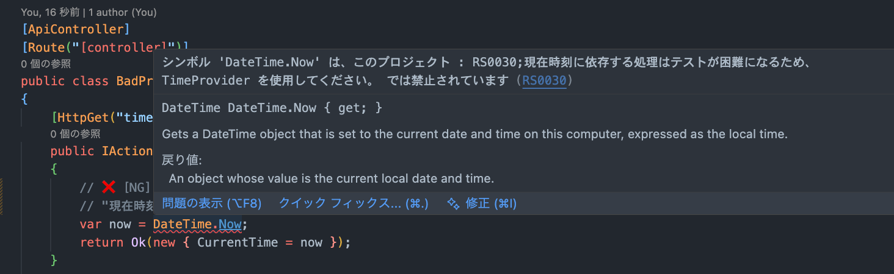

# Banned API Analyzer 導入・運用事例サンプル

## このリポジトリについて

本リポジトリは、チーム開発におけるコード品質の均一化と、プロジェクト固有ルールの遵守を自動化するために導入した **`Microsoft.CodeAnalysis.BannedApiAnalyzers`** の活用事例です。

実際の開発現場でよくある「スキルレベル差による品質のばらつき」や「レビューコストの増大」といった課題に対し、静的解析を用いてどのように解決したかをコードと共に示します。

## 導入前のチーム状況と課題

チーム開発において、一般的に以下のような課題が発生することがあります。

- チーム構成の多様性
    - ジュニアからシニアまでスキルレベルが異なるエンジニアが混在しており、コードの品質にばらつきが生じていました。
- 「動くけど非推奨」なコードの混入
    - テストが困難な実装（`DateTime.Now` の直接利用など）や、本番環境で不適切な実装（`Console.WriteLine` など）が散見されました。
- 定型的な指摘の増加とレビューコスト
    - 「ここは `DateTime` を直接使わないでください」といった定型的な指摘が繰り返され、レビュアーのリソースが本質的な設計レビュー以外に割かれていました。
- ルールの強制力不足
    - Wikiや口頭でのルール共有では限界があり、プロジェクト固有の規約（アーキテクチャルールなど）を徹底することが困難でした。

## 既存のツール（EditorConfig等）との違い

EditorConfig や標準の静的解析ツール（Roslyn Analyzers）でも一般的な品質管理は可能ですが、特定の課題解決には限界がある場合があります。

- 「文脈依存」のルールを強制できない
    - `DateTime.Now` や `Console.WriteLine` は言語仕様として正しいコードであり、一般的なリンターでは警告されません。「特定のテスト戦略上、使用を禁止したい」といったプロジェクト固有の文脈を反映させる必要があります。
- 「代替案」を提示できない
    - 既存ツールで無理やり禁止しても、「なぜダメなのか」「代わりに何を使えばいいのか」までは開発者に伝わりません。エラーメッセージを通じて具体的な解決策を提示する仕組みが必要でした。

## 導入した仕組みと工夫

これらの課題を解決するために、静的解析ツール **`Microsoft.CodeAnalysis.BannedApiAnalyzers`** を導入し、「ルールを破るとビルドが通らない」仕組みを構築します。

### 運用のポイント

1.  「後で直す」を許さないためのエラー化
    - 警告のままでは無視されてしまうことが多いため、CI で確実に弾くためにエラーとして扱います。
2.  「なぜダメなのか」をその場で伝える
    - 単に禁止するだけでなく、Analyzer のメッセージ機能を使って「なぜ禁止なのか」「代わりに何を使うべきか」を明示し、開発者が迷わないように配慮します。

## 運用ルールの例（抜粋）

実務でよく採用されるルールの中から、汎用的なものをいくつかピックアップして再現しています。

### Case 1: テストしやすくするためのルール

ユニットテストにおいて現在時刻やランダム値に依存するコードは、再現性を損なう原因となります。

- [NG] 禁止
    - `System.DateTime.Now`, `System.DateTime.UtcNow`
- [OK] 推奨
    - `TimeProvider` クラス (.NET 8+)
- **表示されるエラーメッセージ**
    > `System.DateTime.Now` is banned in this project: 現在時刻に依存する処理はテストが困難になるため、TimeProvider を使用してください。

### Case 2: ログを正しく残すためのルール

コンソール出力はクラウド環境やサーバー環境ではログとして適切に収集されない場合があり、構造化ログへの移行が必要でした。

- [NG] 禁止
    - `System.Console.WriteLine`, `System.Console.Write`
- [OK] 推奨
    - `Microsoft.Extensions.Logging.ILogger`
- **表示されるエラーメッセージ**
    > `System.Console.WriteLine` is banned in this project: コンソール出力はログ基盤に収集されない可能性があるため、ILogger を使用してください。

### Case 3: パフォーマンス低下を防ぐルール

スケーラビリティを確保するため、I/O処理における同期メソッドの使用を禁止しました。

- [NG] 禁止
    - `System.IO.File.ReadAllText` などの同期API
- [OK] 推奨
    - `ReadAllTextAsync` などの非同期API
- **表示されるエラーメッセージ**
    > `System.IO.File.ReadAllText` is banned in this project: スレッドプールの枯渇を防ぐため、I/O処理には非同期メソッドを使用してください。

## 実際の挙動 (Demo)

### 1. ビルド時のエラー出力 (CI/CLI)
ルール違反がある状態でビルドすると、以下のように具体的な修正指示を含んだエラーが発生し、ビルドが停止します。

```text
BannedApiExample/Controllers/BadPracticeController.cs(13,19): error RS0030: The symbol 'DateTime.Now' is banned in this project: RS0030;現在時刻に依存する処理はテストが困難になるため、TimeProvider を使用してください。
BannedApiExample/Controllers/BadPracticeController.cs(21,9): error RS0030: The symbol 'Console' is banned in this project: RS0030;コンソール出力はログ基盤に収集されない可能性があるため、ILogger を使用してください。
BannedApiExample/Controllers/BadPracticeController.cs(32,27): error RS0030: The symbol 'File.ReadAllText(string)' is banned in this project: RS0030;スレッドプールの枯渇を防ぐため、I/O処理には非同期メソッドを使用してください。
```

### 2. IDE上での表示 (開発体験)
エディタ上でもリアルタイムに赤波線が表示され、マウスオーバーで修正方法を確認できます。

**DateTime.Now の禁止例**


**Console.WriteLine の禁止例**


## 導入による効果（期待値）

この仕組みを導入することで、以下のような効果が期待できます。

- レビューコストの削減と質の向上
    - 「このメソッドは使わないで」といった定型的な指摘を自動化できるため、レビュアーは設計やビジネスロジックの確認に集中できます。
- プロジェクト固有ルールのドキュメント化と強制
    - Wikiなどに書かれがちな「暗黙のルール」をコード（設定ファイル）として管理し、ビルドエラーとして強制力を持たせることができます。
- 低コストでの運用開始
    - 独自の静的解析ツールを開発することなく、設定ファイルの記述だけで即座にルールを適用できるため、小さく始めて徐々にルールを育てていく運用が可能です。
- オンボーディングの効率化
    - 新規参画メンバーも、IDE上のエラーメッセージを通じて「なぜこのコードがダメなのか」「どう書くべきか」を自然に学習できます。

## プロジェクト構成

主要なファイルへのリンクと解説です。

- **[BannedSymbols.txt](BannedApiExample/BannedSymbols.txt)**
  - ⚠️ **最重要**: 禁止APIとエラーメッセージの定義ファイル
- **[BannedApiExample.csproj](BannedApiExample/BannedApiExample.csproj)**
  - Analyzerパッケージの参照と `TreatWarningsAsErrors` (警告をエラーとして扱い、ビルドを停止させる) の設定
- **Controllers/**
  - **[BadPracticeController.cs](BannedApiExample/Controllers/BadPracticeController.cs)**
    - [NG] 禁止APIを使用したコード例（ビルドエラーになります）
  - **[GoodPracticeController.cs](BannedApiExample/Controllers/GoodPracticeController.cs)**
    - [OK] 推奨APIを使用した修正コード例
- **[Program.cs](BannedApiExample/Program.cs)**
  - `TimeProvider` などのDI設定
